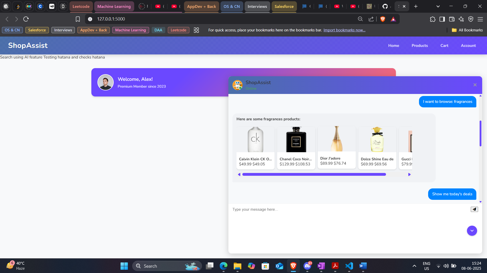

# ShopAssist – AI-Powered E-commerce Chatbot

ShopAssist is a modern, AI-powered e-commerce chatbot web application. It enables users to discover products, browse categories, manage their shopping cart, and get instant support—all through a conversational interface. The project demonstrates a full-stack approach using Flask (Python), HTML/CSS/JS, and integration with Microsoft Power Platform Copilot Studio for AI-powered product search.

---

## Project Summary

ShopAssist is designed to provide a seamless and interactive shopping experience using conversational AI. The application consists of a Flask backend serving a responsive frontend, with the following core features:

- **Conversational Shopping**: Users interact with a chatbot UI to search for products, get recommendations, and receive support.
- **AI-Powered Search**: Natural language queries are processed using Microsoft Power Platform Copilot Studio, allowing users to search for products just by describing what they want (e.g., "Show me waterproof watches under $100").
- **Product Browsing**: Users can browse products by category, view product details, and add items to their cart.
- **Shopping Cart Management**: Add, remove, and update items in the cart, with a clear checkout flow.
- **Deals & Promotions**: Special offers and discounts are highlighted within the chat interface.
- **FAQ & Support**: Access help and support via a dedicated FAQ page and chatbot responses.
- **Accessibility**: The UI is designed for keyboard navigation, screen readers, and high color contrast for readability.

### How It Works

1. **Backend (Flask)**: Handles API endpoints for product data, chat interactions, and serves the frontend templates.
2. **Frontend (HTML/CSS/JS)**: Provides a modern, responsive chat interface for users to interact with the bot and browse products.
3. **AI Integration**: User queries are sent to Microsoft Power Platform Copilot Studio for intelligent product search. If the AI service is unavailable, the app falls back to local search using a sample `products.json` file.
4. **Data Handling**: Product data is loaded from `static/products.json` or fetched from [DummyJSON](https://dummyjson.com/products) as a fallback.

---

## Key Features

- **Browse Products**: Users can explore products by category, view details, and add items to their cart directly from the chat interface.
- **Search with AI**: By leveraging Copilot Studio, users can type natural language queries to find products (e.g., "Find me red running shoes for women").
- **Cart Management**: The chatbot supports adding, removing, and updating cart items, with a summary and checkout option.
- **Instant Support**: The FAQ page and chatbot provide quick answers to common questions and support requests.
- **Accessibility**: Designed for all users, with keyboard and screen reader support, and high-contrast UI.

---



## Table of Contents

- [ShopAssist – AI-Powered E-commerce Chatbot](#shopassist--ai-powered-e-commerce-chatbot)
  - [Project Summary](#project-summary)
    - [How It Works](#how-it-works)
  - [Key Features](#key-features)
  - [Table of Contents](#table-of-contents)
  - [Installation \& Setup](#installation--setup)
    - [Prerequisites](#prerequisites)
    - [Steps](#steps)
  - [Running the Application](#running-the-application)
  - [Usage Guide](#usage-guide)
  - [Dummy Data](#dummy-data)
  - [AI Integration (Copilot Studio)](#ai-integration-copilot-studio)
  - [Accessibility](#accessibility)
  - [License](#license)

---

## Installation & Setup

### Prerequisites

- Python 3.8+
- pip (Python package manager)

### Steps

1. **Clone the repository**

   ```powershell
   git clone <your-repo-url>
   cd Uplyft
   ```

2. **Create a virtual environment (recommended)**

   ```powershell
   python -m venv venv
   .\venv\Scripts\activate
   ```

3. **Install dependencies**

   ```powershell
   pip install -r requirements.txt
   ```

4. **Start the Flask server**

   ```powershell
   python index.py
   ```

5. **Open your browser** and go to [http://127.0.0.1:5000/](http://127.0.0.1:5000/)

---

## Running the Application

1. **Clone the repository**

   ```powershell
   git clone <your-repo-url>
   cd Uplyft
   ```

2. **Create a virtual environment (recommended)**

   ```powershell
   python -m venv venv
   .\venv\Scripts\activate
   ```

3. **Install dependencies**

   ```powershell
   pip install -r requirements.txt
   ```

4. **Start the Flask server**

   ```powershell
   python index.py
   ```

5. **Open your browser** and go to [http://127.0.0.1:5000/](http://127.0.0.1:5000/)

---

## Usage Guide

- **Open the chat**: Click the "Chat with us" button at the bottom right.
- **Browse products**: Use quick reply buttons or type your query.
- **Search with AI**: Click "Search with AI" and enter a natural language query (e.g., "Show me waterproof watches under $100").
- **View product details**: Click on any product card to see more info and add to cart.
- **Manage cart**: Add, remove, or update items. Proceed to checkout from the cart view.
- **Get help**: Use the FAQ/help button or type your question.

---

## Dummy Data

- **products.json** in `/static/` contains sample product data used for local browsing and fallback.
- **Structure Example:**

  ```json
  {
    "products": [
      {
        "id": 1,
        "title": "iPhone 9",
        "description": "An apple mobile which is nothing like apple",
        "price": 549,
        "discountPercentage": 12.96,
        "rating": 4.69,
        "stock": 94,
        "brand": "Apple",
        "category": "smartphones",
        "thumbnail": "https://i.dummyjson.com/data/products/1/thumbnail.jpg"
      }
      // ...more products
    ]
  }
  ```

- **Fallback API**: If the local file is missing, the app fetches from [DummyJSON](https://dummyjson.com/products).

---

## AI Integration (Copilot Studio)

- **AI Search**: Integrates with Microsoft Power Platform Copilot Studio for natural language product search.
- **How it works**: User queries are sent to the Copilot Studio endpoint. If the AI is unavailable, the app falls back to local search.
- **Configuration**: For full AI features, set up your Power Platform credentials in a `.env` file (see requirements.txt for related packages).

---

## Accessibility

- **Keyboard navigation**: Tab, Enter, and arrow keys supported throughout the chat UI.
- **Screen reader support**: ARIA roles and live regions for chat messages.
- **Scroll-to-bottom button**: Appears when new messages arrive and user is scrolled up.
- **Color contrast**: Designed for readability and accessibility.

---

## License

This project is for educational and demonstration purposes. For commercial use, please contact the author.

---

**Developed for Uplyft Full Stack Intern Case Study – June 2025**
